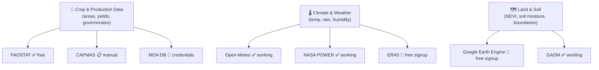

# Data Strategy — Egyptian Agriculture Analysis Platform

## The Big Picture

Your analysis requires **3 layers of data**. Here's how each maps to available sources:



---

## Layer 1: Crop & Production Data

This is the **most critical** layer for your analysis (محاور 1, 2, 3, 5).

### Option A: FAOSTAT (Best for starting) — `FREE, but server unreliable`

FAOSTAT has Egypt crop data by item (wheat, rice, maize, etc.) for **20+ years**.

| Data Available | Columns |
|---|---|
| Crop production | Area harvested (ha), Production (tonnes), Yield (kg/ha) |
| Crops covered | Wheat, Rice, Maize, Cotton, Sugarcane, Tomatoes, Potatoes, etc. |
| Time range | 1961–2022 |

> [!IMPORTANT]
> FAOSTAT API is **currently down (521 error)**. But you can **download CSVs manually**:
> 1. Go to https://www.fao.org/faostat/en/#data/QCL
> 2. Select: Country = **Egypt**, Elements = **Area/Production/Yield**, Years = **2018–2022**
> 3. Click **Download** → CSV
> 4. Place the file in `./data/faostat/`

### Option B: CAPMAS (Egyptian national statistics) — `MANUAL DOWNLOAD`

CAPMAS is THE source for **governorate-level** data (per محافظة).

| Data Available | Details |
|---|---|
| Cultivated area per governorate | ✅ |
| Production per crop per governorate | ✅ |
| Irrigation data | ✅ (some years) |
| Quality indicators | ✅ (some reports) |

**How to get CAPMAS data:**
1. Go to https://www.capmas.gov.eg/
2. Navigate to: **الكتاب الإحصائي السنوي** → **الزراعة**
3. Download the Excel files for years 2018–2022
4. Place them in `./data/capmas/`
5. The pipeline will auto-read them

> [!TIP]
> CAPMAS also publishes data at https://www.capmas.gov.eg/Pages/IndicatorsPage.aspx?page_id=6152&ind_id=2414

### Option C: Ministry of Agriculture DB — `REQUIRES INTERNAL ACCESS`

Only available if you have institutional access. Set up `./credentials/moa_db.json`.

---

## Layer 2: Climate & Weather Data

For **محور 4** (التحليل المناخي). You need per-governorate climate for the same 5 years.

### ✅ Open-Meteo — `ALREADY WORKING`

**Best option.** Covers all 27 Egyptian governorates. Free, no limit.

| Data | Available |
|---|---|
| Temperature (mean/max/min) | ✅ 2020–present |
| Precipitation | ✅ |
| ET0 FAO Evapotranspiration | ✅ (key for water analysis!) |
| Soil moisture (3 depths) | ✅ |
| Solar radiation | ✅ |
| Wind speed | ✅ |

**Action needed:** I'll expand the ingestion to query **all 27 governorate coordinates** for 5 years.

### ✅ NASA POWER — `ALREADY WORKING`

Same as Open-Meteo but from NASA satellites. Good for cross-validation.

### 🔑 ERA5 (Copernicus) — `FREE SIGNUP, 2 minutes`

Higher resolution climate reanalysis. Worth adding.

**How to get CDSAPI_KEY:**
1. Go to https://cds.climate.copernicus.eu/
2. Click **Register** (top right) — use your email
3. After login, go to https://cds.climate.copernicus.eu/profile
4. Copy your **Personal Access Token**
5. Add to [.env](file:///c:/Users/yasee/Projects/Smart-Agriculture-Data-Platform/.env):
   ```
   CDSAPI_URL=https://cds.climate.copernicus.eu/api
   CDSAPI_KEY=your-personal-access-token
   ```

---

## Layer 3: Land, Soil & Satellite Data

For **محور 6** (تحليل ملاءمة الأراضي) and NDVI/vegetation analysis.

### 🔑 Google Earth Engine — `FREE SIGNUP, 5 minutes`

GEE gives you **NDVI, land cover, soil moisture** from satellites — critical for land suitability.

| Data | Source | Resolution |
|---|---|---|
| NDVI (vegetation health) | Sentinel-2, MODIS | 10m / 250m |
| Land cover classification | ESA WorldCover | 10m |
| Soil moisture | SMAP | 10km |
| Cropland extent | GFSAD | 30m |

**How to get GEE credentials:**

**Option A: Personal account (easiest)**
1. Go to https://code.earthengine.google.com/
2. Sign in with your Google account
3. Accept the Terms of Service
4. In your **container terminal**, run:
   ```bash
   docker exec -it agri-ingestion earthengine authenticate
   ```
5. Follow the URL, paste the token back

**Option B: Service account (for automated runs)**
1. Go to https://console.cloud.google.com/
2. Create a project → Enable **Earth Engine API**
3. Go to **IAM → Service Accounts** → Create one
4. Download the JSON key
5. Place it in `./secrets/gee-sa-key.json`

---

## Water Consumption Analysis (محور 3)

> [!IMPORTANT]
> Water consumption data requires **combining** crop data + climate data.

| What you need | Source |
|---|---|
| ET0 (reference evapotranspiration) | ✅ Open-Meteo (already working) |
| Crop coefficients (Kc) | FAO Irrigation & Drainage Paper 56 (embedded in code) |
| Actual crop water use = ET0 × Kc | Calculated |
| Irrigation efficiency benchmarks | FAO AQUASTAT |

**I can build**: `ETcrop = ET0 × Kc` for each crop per governorate — this gives you water consumption per crop, efficiency metrics, and actual vs. ideal comparison.

**FAO AQUASTAT** (free, no auth): https://www.fao.org/aquastat/en/ — download Egypt irrigation efficiency data.

---

## Recommended Next Steps

### Immediate (what I can build now):
1. ✅ Expand Open-Meteo to query **all 27 governorates** for 5 years
2. ✅ Add water consumption model (ET0 × Kc)
3. ✅ Calculate per-governorate climate analysis

### You need to provide:
1. 📋 **CAPMAS Excel files** → place in `./data/capmas/`
2. 📋 **FAOSTAT CSV** → download from website, place in `./data/faostat/`
3. 🔑 **ERA5 key** → register at CDS (2 min), add to [.env](file:///c:/Users/yasee/Projects/Smart-Agriculture-Data-Platform/.env)
4. 🔑 **GEE auth** → sign up at Earth Engine (5 min)

### What I'll build with available data:
- Climate analysis for all governorates (5 years)
- Water consumption estimates per crop
- Land suitability scores using NDVI + soil + climate
- Interactive dashboards (Jupyter)
- Predictive models for crop yield

> [!TIP]
> Start by downloading the **CAPMAS** and **FAOSTAT** data — those are the most important for governorate-level crop analysis. The climate and satellite data I can generate automatically.
