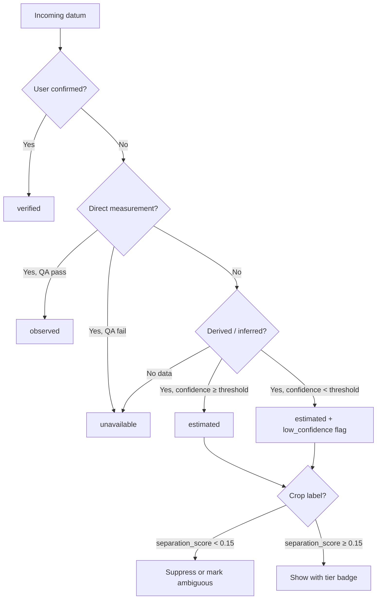
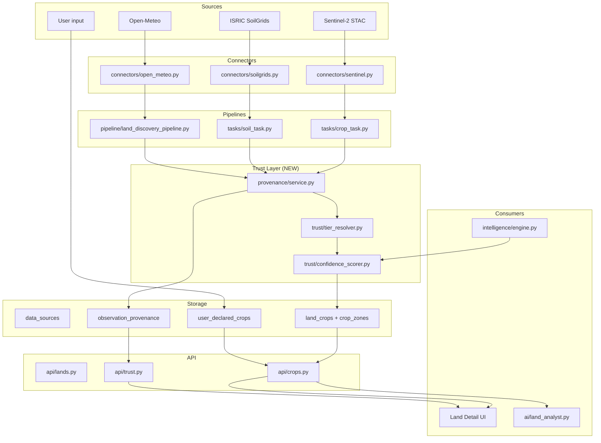
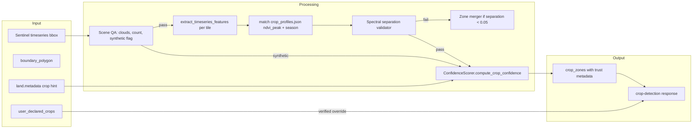
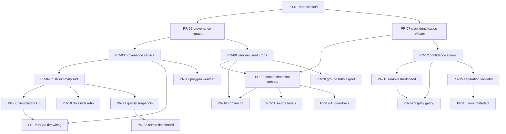

# Data Trust & Confidence Redesign Plan

| Field | Value |
|-------|-------|
| **Document ID** | `DATA-TRUST-REDESIGN-001` |
| **Status** | Draft — awaiting product decisions |
| **Date** | 2026-07-08 |
| **Authors** | Platform Architecture |
| **Stakeholders** | Product, Backend, Frontend, Data/ML, Agronomy |
| **Depends on** | [Land_Detail_Data_Consistency_Audit.md](./Land_Detail_Data_Consistency_Audit.md), [Land_Detail_Data_Consistency_Fix_Plan.md](./Land_Detail_Data_Consistency_Fix_Plan.md) (Phases 0–5 complete) |
| **Target outcome** | Honest, measurable trust tiers — users know what to trust and what requires confirmation |

---

## Overview

The Smart Agriculture Data Platform has **strong land scoping** (`land_id` filtering across repositories) and **trustworthy raw observations** in many cases (Sentinel-2 NDVI when not synthetic, Open-Meteo climate trends at centroid, satellite thumbnails). However, **derived intelligence — especially crop identification — is presented with false certainty**.

This redesign introduces a **Data Trust Layer** that:

1. Labels every datum with a **trust tier** (`verified` / `observed` / `estimated` / `unavailable`)
2. Replaces misleading labels (e.g. `"ML crop detection"`, `detection_method: "spectral_signature"`) with **honest method disclosure**
3. Computes **measurable confidence** instead of hardcoded `0.85` / `0.95`
4. Elevates **user-confirmed crops** as the highest-trust source for crop labels
5. Gates AI insights so unverified crop names are never stated as fact
6. Closes spatial/temporal gaps (centroid weather vs polygon satellite, SoilGrids timeouts)

**Success definition:** A farmer viewing Giza Farm (`land_id=7`) sees:
- NDVI chart tagged **Observed** (Sentinel-2, 136 real rows)
- Crop label tagged **Estimated** with method `"ndvi_profile_match"` and confidence 0.42 unless user confirms
- Secondary zone (grapes 21%) shown with separation warning when NDVI delta < 0.05
- Soil profile **Unavailable** with retry CTA when SoilGrids timed out
- AI insight says *"Spectral pattern suggests winter onion; please confirm"* — not *"Your winter onion crop is…"*

---

## Background & Motivation

### What Phases 0–5 fixed (consistency, not trust)

The [Land Detail Data Consistency Fix Plan](./Land_Detail_Data_Consistency_Fix_Plan.md) addressed presentation alignment:

| Area | Status | Remaining trust gap |
|------|--------|---------------------|
| Primary-zone NDVI filtering | ✅ Done | Confidence still hardcoded |
| Synthetic NDVI banner | ✅ Done | Crop label still shown as fact |
| Image `ndvi_mean` backfill | ✅ Done | — |
| 365d Sentinel window alignment | ✅ Done | Centroid vs bbox still unlabeled in scoring |
| Temperature min/mean storage | ✅ Done | — |
| Soil profile on land detail | ✅ Done | SoilGrids failure = silent empty |
| Source footers (`LAND_DETAIL_SOURCES`) | ✅ Done | `cropZones` still says "ML crop detection" |
| Read-only `GET /crop-health` | ✅ Done | Engine docstring still claims ML path |

### Critical trust failures (must fix)

#### 1. Crop detection is rule-based, not ML

`services/backend/app/tasks/crop_task.py`:

- **Imports** `predict_crop` from `app.ml.crop_classifier` (line 11) but **never calls it**
- Actual logic (lines 137–156): per-tile NDVI peak month + closest `ndvi_peak` in `crop_profiles.json`
- Log message contradicts code: `"Predicting crops for %d tiles using Agronomic Rules"` vs docstring claiming ML
- Hardcoded confidence: `avg_confidence=0.85` (zone), `confidence=0.95` (rows) — lines 221, 242

#### 2. API/UI misrepresent method

`services/backend/app/crops/service.py` → `get_crop_detection()`:

```python
detection_method="spectral_signature",  # line 108 — implies ML/spectral library match
```

Frontend `landDetailUtils.jsx`:

```javascript
cropZones: "ML crop detection · Sentinel-2 STAC",  // line 84
```

`LandCropsSection.jsx` displays `zone.avg_confidence` as a percentage bar with no tier context.

#### 3. ML model is synthetic-only

`services/backend/app/ml/crop_classifier.py` trains `RandomForestClassifier` exclusively on `generate_synthetic_dataset()` from `synthetic_data.py`. Not suitable for production crop ID without ground-truth retraining.

#### 4. Multi-zone noise presented as composition

Giza Farm example: winter onion 79% + grapes 21% with NDVI 0.349 vs 0.362 — indistinguishable spectrally. Zones pass the 5% area threshold (`crop_task.py` line 189) without separation validation.

#### 5. Spatial/temporal mismatch affects trust

| Signal | Geometry | Trust impact |
|--------|----------|--------------|
| Climate, soil moisture, ET₀ | Open-Meteo at **centroid** | Weather may not represent full polygon |
| NDVI, images | Sentinel at **polygon bbox** | Area-weighted; can disagree with centroid climate |
| SoilGrids | Centroid, 25s timeout | Giza Farm: **failed** — UI may show empty profile |

#### 6. AI echoes unverified labels

`services/backend/app/ai/land_analyst.py` builds context from `crop_zones` and instructs Groq to provide confidence, but does not receive trust tiers or user-confirmed overrides. Crop names flow into prompts as ground truth.

### What IS trustworthy today

| Data | Trust basis | Caveat |
|------|-------------|--------|
| Raw Sentinel NDVI (non-synthetic) | Measured reflectance → index | Cloud mask, resolution (~10m) |
| Open-Meteo climate trends | Reanalysis archive | Centroid only; 2–5d lag |
| Satellite thumbnails | STAC scene assets | Visual QA only |
| User-declared land metadata | Direct input | Not yet wired to crop trust |

---

## Goals & Non-Goals

### Goals

| # | Goal | Measurable target |
|---|------|-------------------|
| G1 | Every API field exposing derived values includes `trust_tier`, `provenance`, and `confidence` where applicable | 100% of land-detail endpoints by Phase 3 |
| G2 | Crop labels never shown above **Estimated** tier without measured separation or user confirmation | 0 production labels at Verified tier without ground truth |
| G3 | Replace hardcoded confidence with computed scores | No literal `0.85`/`0.95` in `crop_task.py` after Phase 3 |
| G4 | User-confirmed crops become **Verified** and supersede spectral guesses | API returns `detection_method: "user_confirmed"` |
| G5 | Multi-zone splits require spectral separation score > 0.15 to display secondary crop | Giza-like splits suppressed or flagged |
| G6 | AI insights include trust-aware language | 0 instances of unverified crop stated as fact in prompt output |
| G7 | SoilGrids fetch success rate ≥ 95% with retries | Monitored per land |
| G8 | Admin/ops dashboard for data quality | Pipeline health visible within 30s |

### Non-Goals

- **100% automated crop identification from satellite alone** — not achievable without field truth; we aim for honest tiers
- **Replacing Sentinel with commercial sub-meter imagery** — out of scope
- **Real-time sub-hourly monitoring** — existing batch pipeline remains
- **Full retrain of ML model in Phase 1** — deferred to Phase 7 decision gate
- **Mobile app parity in v1** — web first; mobile follows Phase 9

---

## Trust Model

### Trust tiers

| Tier | Code | Meaning | User-facing label | When to use |
|------|------|---------|-------------------|-------------|
| **Verified** | `verified` | Ground truth or direct measurement with known calibration | "Confirmed" | User-confirmed crop; raw sensor with QA pass; official registry |
| **Observed** | `observed` | Measured remote-sensing or API value with documented method, no crop ID inference | "Observed" | Sentinel NDVI, Open-Meteo temp, STAC image |
| **Estimated** | `estimated` | Model, heuristic, or interpolation with disclosed uncertainty | "Estimated" | Rule-based crop match, harvest prediction, centroid weather on large polygon |
| **Unavailable** | `unavailable` | Fetch failed, insufficient data, or explicitly not computed | "No data" | SoilGrids timeout, < 3 Sentinel scenes |

### Tier assignment rules



### Confidence vs trust tier

- **Trust tier** = epistemic category (what kind of truth is this?)
- **Confidence score** = numeric 0.0–1.0 within tier (how strong is this estimate?)

**Display rule:** Crop label confidence bar shown **only when** `separation_score > 0.15` AND `confidence ≥ 0.35`. Below that, show "Uncertain — confirm crop" without percentage.

### Confidence computation targets (crop identification)

| Signal | Weight | Formula component |
|--------|--------|-------------------|
| NDVI profile fit | 0.30 | `1 - min(|ndvi_peak_observed - ndvi_peak_profile| / 0.25, 1)` |
| Season month match | 0.20 | `1.0` if peak month ∈ `typical_season_months`, else `0.5` |
| Temporal consistency | 0.20 | Fraction of scenes agreeing on top-1 crop |
| Spatial coherence | 0.15 | `1 - entropy(tile_labels) / log(n_crops)` |
| Spectral separation | 0.15 | `clamp((ndvi_zone_a - ndvi_zone_b) / 0.10, 0, 1)` for multi-zone |

**Multi-zone gate:** `separation_score = |mean_ndvi_zone_primary - mean_ndvi_zone_secondary|`. If `< 0.05`, merge zones or label `"mixed_vegetation"`.

**Giza Farm target state:** winter onion confidence ~0.40–0.55 (estimated), grapes secondary hidden or shown as "possible mix" with warning.

---

## Proposed Design

### Architecture overview



### Component responsibilities

| Component | Path | Responsibility |
|-----------|------|----------------|
| `TrustTierResolver` | `app/trust/tier_resolver.py` | Map `(source, method, qa_flags, user_override)` → tier |
| `ConfidenceScorer` | `app/trust/confidence_scorer.py` | Crop, harvest, soil fetch confidence |
| `ProvenanceService` | `app/trust/provenance_service.py` | Write/read `observation_provenance` rows |
| `CropIdentificationService` | `app/crops/identification.py` | Rule-based ID + separation validation (extracted from `crop_task.py`) |
| `UserCropService` | `app/crops/user_crops.py` | CRUD for `user_declared_crops` |
| `TrustBadge` | `web/src/components/TrustBadge.jsx` | Tier + tooltip in UI |

### Crop identification redesign (target state)



**Method taxonomy (honest `detection_method` values):**

| Value | Description | Default tier |
|-------|-------------|--------------|
| `user_confirmed` | User set primary crop | `verified` |
| `user_declared_mix` | User set multi-crop split | `verified` |
| `ndvi_profile_match` | Rule-based `crop_profiles.json` | `estimated` |
| `ml_spectral` | `predict_crop()` RF model | `estimated` (only after Phase 7 gate) |
| `mixed_vegetation` | No separable zones | `estimated` |
| `unknown` | No data | `unavailable` |

**Changes to `crop_task.py`:**

1. Remove unused `predict_crop` import (until Phase 7 enables ML path)
2. Extract identification logic → `app/crops/identification.py`
3. Call `ConfidenceScorer` per zone; persist to `crop_zones.avg_confidence` and `land_crops.confidence`
4. Set `detection_method` on zone metadata (new JSONB column `zone_metadata`)
5. Run `validate_zone_separation()` before creating secondary zones

### Data provenance layer

Every persisted observation gets a provenance record:

```json
{
  "observation_id": "land_crop:12345",
  "land_id": 7,
  "metric": "ndvi",
  "trust_tier": "observed",
  "confidence": 0.92,
  "source_name": "Sentinel-2 L2A (Planetary Computer)",
  "source_id": 3,
  "spatial_scope": "polygon_bbox",
  "spatial_resolution_m": 10,
  "temporal_scope": "scene_datetime",
  "fetch_timestamp": "2026-07-08T10:00:00Z",
  "qa_flags": ["cloud_lt_20pct", "real_data"],
  "derivation": null
}
```

Derived crop label provenance:

```json
{
  "metric": "crop_type",
  "trust_tier": "estimated",
  "confidence": 0.44,
  "derivation": {
    "method": "ndvi_profile_match",
    "inputs": ["ndvi_timeseries", "crop_profiles.json"],
    "separation_score": 0.013,
    "ambiguous": true
  }
}
```

**Leverage existing `data_sources` table** (`app/models/data_source.py`) — extend usage so `confidence_score` reflects rolling fetch success rate, not a static placeholder.

### User-confirmed crops

New flow:

1. Land detail shows estimated crop with **"Confirm or correct"** CTA
2. User selects crop from `crop_profiles.json` keys (+ "Mixed / Other" free text)
3. `POST /lands/{id}/declared-crops` upserts `user_declared_crops`
4. `get_crop_detection()` checks user declaration first → returns `verified` tier
5. Spectral zones remain visible as "Suggested" beneath confirmed crop

**Conflict handling (Giza Farm: user says "Vegetables or Citrus", system says "Winter Onion"):**

- UI shows both with explicit conflict banner
- AI prompt: `"User describes: Vegetables/Citrus. Spectral estimate: Winter Onion (confidence 0.44, ambiguous). Do not assert either as fact."`

### Spatial alignment (polygon weather sampling)

Phase 5 introduces `connectors/open_meteo_polygon.py`:

- Sample centroid + 4 bbox corners (or 3×3 grid for large polygons)
- Store per-point values + polygon mean in `land_climate.payload.spatial_sample`
- Trust tier: `observed` at each point; `estimated` for polygon aggregate if corner spread > threshold (e.g. temp range > 3°C)
- UI footer: `"Open-Meteo · polygon mean (5 points)"` replacing centroid-only label

### SoilGrids reliability

Enhance `connectors/soilgrids.py` + `tasks/soil_task.py`:

- Retry: 3 attempts, exponential backoff (5s, 15s, 45s)
- Timeout: 25s → 45s per attempt
- Persist failure reason in `land_soil_profiles.fetch_status` (`success` | `timeout` | `empty` | `error`)
- Trust tier `unavailable` with `retry_available: true`
- Background retry job in discovery + manual "Retry soil fetch" button

### AI guardrails

Update `land_analyst.py`:

1. Inject `trust_context` per zone: tier, confidence, method, ambiguous flag
2. Extend system prompt:

   > Never state crop type as fact unless `trust_tier` is `verified`. For `estimated` crops, use language like "spectral pattern suggests…". If `ambiguous: true`, recommend user confirmation.

3. Post-process LLM output: `trust_linter.py` flags sentences asserting unverified crops
4. Store `insight.payload.trust_warnings[]` on `LandAiInsight`

### Intelligence engine alignment

`intelligence/engine.py` docstring claims ML path (step 4–5) but pipeline uses `crop_task` output. Refactor:

- Engine **reads** trust-scored zones from DB; does not re-invent crop labels
- `ConsistencyValidator._rule_confidence_threshold` uses computed confidence, not hardcoded
- Harvest/yield remain `estimated` tier with separate confidence

---

## API / Interface Changes

### New endpoints

| Method | Path | Purpose |
|--------|------|---------|
| `GET` | `/lands/{public_id}/trust-summary` | Aggregated trust tiers per section |
| `GET` | `/lands/{public_id}/provenance` | Paginated provenance records |
| `POST` | `/lands/{public_id}/declared-crops` | User confirm/override crops |
| `GET` | `/lands/{public_id}/declared-crops` | Read user declarations |
| `DELETE` | `/lands/{public_id}/declared-crops/{id}` | Remove override |
| `POST` | `/lands/{public_id}/soil-profile/retry` | Trigger SoilGrids retry |
| `GET` | `/admin/data-quality` | Ops dashboard metrics |

### Modified response shapes

**`CropDetectionResponse`** (`app/crops/schemas.py`):

```python
class TrustMetadata(BaseModel):
    trust_tier: Literal["verified", "observed", "estimated", "unavailable"]
    confidence: float
    method: str
    separation_score: Optional[float] = None
    ambiguous: bool = False
    provenance_id: Optional[str] = None

class DetectedCropItem(BaseModel):
    crop_type: str
    confidence: float
    trust: TrustMetadata
    ndvi_mean: float
    growth_stage: Optional[str] = None
    is_primary: bool = False
    suppressed: bool = False  # hidden from UI when separation fails

class CropDetectionResponse(BaseModel):
    land_id: int
    detected_crop_type: Optional[str]
    detected_crops: list[DetectedCropItem]
    detection_method: str  # honest method id
    user_confirmed: bool
    confidence: float
    trust_tier: str
    ndvi_current: float
    health: str
    note: str
    conflict_with_user_description: bool = False
```

**Timeseries payload** (all metrics):

```json
{
  "timestamp": "2026-01-15T00:00:00Z",
  "value": 0.42,
  "trust": { "tier": "observed", "confidence": 0.91 },
  "provenance": { "source": "Sentinel-2 L2A", "spatial_scope": "polygon_bbox" }
}
```

### Breaking changes

| Change | Migration |
|--------|-----------|
| `detection_method: "spectral_signature"` → `"ndvi_profile_match"` | API v1.1; map old value in docs |
| Secondary zones may be suppressed | Clients must handle `suppressed: true` |
| Confidence values will drop (0.95 → ~0.45) | UI must show tier, not raw % alone |

---

## Data Model Changes

### New tables

#### `user_declared_crops`

| Column | Type | Notes |
|--------|------|-------|
| `declaration_id` | PK serial | |
| `land_id` | FK → lands | |
| `crop_type` | varchar(128) | Key from `crop_profiles.json` or custom |
| `area_pct` | numeric(5,2) nullable | For multi-crop declarations |
| `season` | varchar(32) nullable | e.g. `2025-26` |
| `declared_by` | FK → users | |
| `declared_at` | timestamptz | |
| `source` | varchar(32) | `manual` \| `import` \| `survey` |
| `notes` | text nullable | Field notes |
| `is_primary` | boolean | |
| `trust_tier` | varchar(16) | Always `verified` |

#### `observation_provenance`

| Column | Type | Notes |
|--------|------|-------|
| `provenance_id` | PK UUID | |
| `land_id` | FK | |
| `observation_type` | varchar(64) | `land_crop`, `land_climate`, etc. |
| `observation_ref_id` | bigint nullable | FK to specific row |
| `metric` | varchar(64) | `ndvi`, `crop_type`, `ph`, etc. |
| `trust_tier` | varchar(16) | |
| `confidence` | numeric(5,4) | |
| `source_id` | FK → data_sources | |
| `spatial_scope` | varchar(32) | `centroid` \| `polygon_bbox` \| `polygon_mean` |
| `derivation` | JSONB | method, inputs, qa_flags |
| `created_at` | timestamptz | |

#### `land_data_quality_snapshots` (monitoring)

| Column | Type | Notes |
|--------|------|-------|
| `snapshot_id` | PK | |
| `land_id` | FK | |
| `computed_at` | timestamptz | |
| `metrics` | JSONB | per-section tier counts, gaps |
| `overall_trust_score` | numeric(5,2) | 0–100 composite |

### Modified tables

#### `crop_zones`

| New column | Type | Purpose |
|------------|------|---------|
| `detection_method` | varchar(32) | Honest method id |
| `trust_tier` | varchar(16) | |
| `separation_score` | numeric(5,4) nullable | vs primary zone |
| `ambiguous` | boolean default false | |
| `zone_metadata` | JSONB | derivation details |

#### `land_crops`

| New column | Type | Purpose |
|------------|------|---------|
| `trust_tier` | varchar(16) | Usually `observed` for NDVI |
| `is_synthetic` | boolean | Already partially via source; explicit flag |
| `provenance_id` | UUID FK nullable | |

#### `land_soil_profiles`

| New column | Type | Purpose |
|------------|------|---------|
| `fetch_status` | varchar(16) | `success` \| `timeout` \| `error` |
| `fetch_attempts` | int | |
| `last_fetch_error` | text nullable | |
| `trust_tier` | varchar(16) | |

#### `land_ai_insights`

| New column | Type | Purpose |
|------------|------|---------|
| `trust_warnings` | JSONB | Linter output |
| `min_input_trust_tier` | varchar(16) | Weakest input tier used |

#### `data_sources`

| New column | Type | Purpose |
|------------|------|---------|
| `source_type` | varchar(32) | `satellite` \| `reanalysis` \| `static` |
| `default_trust_tier` | varchar(16) | |
| `rolling_success_rate` | numeric(5,4) | Updated by pipeline |

---

## Alternatives Considered

### Alternative 1: Keep rules, label honestly (minimal change)

**Approach:** Rename UI/API strings only; keep hardcoded confidence.

| Pros | Cons |
|------|------|
| Fast (~3 days) | Users still see 85% confidence — trust damage continues |
| Low risk | Does not fix multi-zone noise or AI guardrails |

**Decision:** Rejected as insufficient. Honest labels without honest scores still mislead.

### Alternative 2: Full ML retrain before any UI change

**Approach:** Collect ground-truth dataset, retrain `crop_classifier.py`, deploy ML path in `crop_task.py`.

| Pros | Cons |
|------|------|
| Potentially higher crop ID accuracy | Requires labeled data we don't have; months of delay |
| Matches original architecture intent | Synthetic-trained model may harm trust further if rushed |

**Decision:** Deferred to Phase 7 gate. Ship trust layer + user confirmation first.

### Alternative 3: Hybrid with user ground truth (selected)

**Approach:** Rule-based spectral estimate (estimated tier) + user confirmation (verified tier) + provenance on everything.

| Pros | Cons |
|------|------|
| Honest immediately | Requires UX investment for confirmation flow |
| Improves ML training data over time | Two sources of truth to reconcile in UI |
| Matches farmer mental model | |

**Decision:** **Selected** — best path to "good confidence" without overclaiming.

### Alternative 4: Third-party crop maps (Copernicus CGLS-LC100)

**Approach:** Replace local rules with land-cover layer.

| Pros | Cons |
|------|------|
| Global coverage | 100m resolution; coarse for field-level |
| Published accuracy metrics | May not list specific crops (winter onion vs grapes) |

**Decision:** Consider as enrichment signal in Phase 7+, not primary ID.

---

## Security & Privacy

| Concern | Mitigation |
|---------|------------|
| `user_declared_crops` spoofing | `require_land_access` on all declaration endpoints; audit `declared_by` |
| Provenance leakage across tenants | All provenance queries filter by `land_id` + ownership |
| AI prompt injection via `notes` field | Sanitize user notes; max 500 chars; strip control characters |
| Admin dashboard exposure | `require_admin` role; no PII in aggregate metrics |
| SoilGrids / external API keys | No keys required today; rate-limit retries per land to prevent abuse |
| Trust tier manipulation | Tiers computed server-side only; never accepted from client |

---

## Observability

### Data quality metrics (Prometheus / logs)

| Metric | Labels | Alert threshold |
|--------|--------|-----------------|
| `trust_tier_assignments_total` | `tier`, `metric` | — |
| `crop_detection_confidence_histogram` | `method` | p50 < 0.3 → review profiles |
| `crop_zone_separation_score` | `land_id` | — |
| `soilgrids_fetch_success_rate` | — | < 0.95 over 24h |
| `sentinel_synthetic_fallback_total` | `land_id` | any in prod |
| `ai_trust_linter_warnings_total` | — | spike > 10/hour |
| `provenance_write_failures_total` | — | > 0 |

### Pipeline health dashboard (Phase 10)

- Lands by worst tier per section
- SoilGrids failure map
- Crop ambiguous rate
- User confirmation rate (target: > 30% of active lands within 90 days)
- Giza Farm (`land_id=7`) as canary land with expected tier snapshot

### Logging

Structured log on every crop detection run:

```python
logger.info(
    "crop_detection_complete",
    extra={
        "land_id": 7,
        "method": "ndvi_profile_match",
        "primary_crop": "Winter Onion",
        "confidence": 0.44,
        "separation_score": 0.013,
        "ambiguous": True,
        "synthetic": False,
        "scene_count": 136,
    },
)
```

---

## Rollout Plan

### Phase 1 — Trust infrastructure (provenance, tiers, UI badges)

**Effort:** 5–6 days | **Priority:** P0

| Task | Files | Acceptance criteria |
|------|-------|-------------------|
| 1.1 Trust module scaffold | `app/trust/tier_resolver.py`, `confidence_scorer.py`, `provenance_service.py` | Unit tests for tier mapping |
| 1.2 DB migrations | `observation_provenance`, `crop_zones` new cols | Migration applies cleanly |
| 1.3 Provenance writes in crop_task | `tasks/crop_task.py` | Each `insert_land_crop_snapshot` has provenance row |
| 1.4 `GET /trust-summary` | `api/trust.py` | Returns tiers for ndvi, climate, soil, crops |
| 1.5 `TrustBadge` component | `web/src/components/TrustBadge.jsx` | Renders 4 tiers with tooltips |
| 1.6 Wire badges to NDVI section | `LandCropsSection.jsx`, `LandEnvironmentSection.jsx` | NDVI shows "Observed"; no crop badge yet |

**Exit gate:** Giza Farm NDVI tagged Observed; crop section unchanged functionally.

---

### Phase 2 — Crop detection honesty + user override

**Effort:** 4–5 days | **Priority:** P0

| Task | Files | Acceptance criteria |
|------|-------|-------------------|
| 2.1 Extract `CropIdentificationService` | `app/crops/identification.py` | Same output as current rules, test parity |
| 2.2 Honest `detection_method` | `crops/service.py`, `schemas.py` | No `spectral_signature` in new responses |
| 2.3 `user_declared_crops` table + API | `models/`, `api/crops.py` | POST confirm crop → verified tier |
| 2.4 UI confirm/correct flow | `LandCropsSection.jsx`, `useLandDetail.js` | Modal with crop picker |
| 2.5 Update `LAND_DETAIL_SOURCES` | `landDetailUtils.jsx` | `cropZones` → `"NDVI profile match · Sentinel-2"` |
| 2.6 User description conflict banner | `LandDetailHeader.jsx` | Giza Farm shows conflict when metadata disagrees |

**Exit gate:** API returns `ndvi_profile_match`; user can confirm crop; UI never says "ML crop detection".

---

### Phase 3 — Real confidence scoring

**Effort:** 4–5 days | **Priority:** P0

| Task | Files | Acceptance criteria |
|------|-------|-------------------|
| 3.1 Implement `ConfidenceScorer.compute_crop_confidence` | `app/trust/confidence_scorer.py` | Unit tests with Giza-like fixtures |
| 3.2 Remove hardcoded 0.85/0.95 | `tasks/crop_task.py` | Grep finds zero hardcoded zone confidence |
| 3.3 Confidence display gating | `LandCropsSection.jsx` | Bar hidden when separation < 0.15 |
| 3.4 Backfill script | `scripts/backfill_crop_confidence.py` | All lands recalculated |
| 3.5 API tests update | `tests/api/test_crop_endpoints.py` | Assert confidence ∈ [0,1], not 0.95 |

**Measurable target:** Giza Farm primary crop confidence 0.35–0.60 (not 0.85).

---

### Phase 4 — Multi-zone validation (spectral separation)

**Effort:** 3–4 days | **Priority:** P1

| Task | Files | Acceptance criteria |
|------|-------|-------------------|
| 4.1 `validate_zone_separation()` | `app/crops/identification.py` | Giza grapes zone suppressed or `ambiguous: true` |
| 4.2 Zone merger | `crop_task.py` | Zones with ΔNDVI < 0.05 merged to `mixed_vegetation` |
| 4.3 API exposes all zones + suppressed | `get_crop_detection` | `detected_crops` includes suppressed with flag |
| 4.4 UI ambiguous mix warning | `LandCropsSection.jsx` | Warning when `ambiguous: true` |

**Measurable target:** No secondary crop shown when separation < 0.05 unless user declared mix.

---

### Phase 5 — Spatial alignment (polygon weather sampling)

**Effort:** 5–6 days | **Priority:** P1

| Task | Files | Acceptance criteria |
|------|-------|-------------------|
| 5.1 `open_meteo_polygon.py` | `connectors/open_meteo_polygon.py` | 5-point sample for bbox |
| 5.2 Pipeline integration | `land_discovery_pipeline.py` | Climate rows store `spatial_sample` |
| 5.3 Trust tier for aggregate | `tier_resolver.py` | Spread > 3°C → estimated aggregate |
| 5.4 UI footer update | `landDetailUtils.jsx`, `LandEnvironmentSection.jsx` | Shows "polygon mean (5 points)" |
| 5.5 Large polygon warning | UI | Area > 50 ha + high spread → notice |

**Exit gate:** Climate provenance includes `spatial_scope: polygon_mean`.

---

### Phase 6 — SoilGrids reliability + retries

**Effort:** 3 days | **Priority:** P1

| Task | Files | Acceptance criteria |
|------|-------|-------------------|
| 6.1 Retry/backoff | `connectors/soilgrids.py`, `tasks/soil_task.py` | 3 attempts; success on flaky network |
| 6.2 `fetch_status` persistence | `land_soil_profiles` migration | Giza Farm shows `timeout` not empty |
| 6.3 `POST /soil-profile/retry` | `api/soil.py` | Manual retry succeeds |
| 6.4 UI unavailable state | `LandEnvironmentSection.jsx` | "Soil profile unavailable — Retry" CTA |
| 6.5 Monitoring | metrics | `soilgrids_fetch_success_rate` ≥ 0.95 |

---

### Phase 7 — ML path decision gate

**Effort:** 5–10 days (branching) | **Priority:** P2

**Decision checkpoint:** After 30 days of user confirmations collected.

| Option A: Deprecate ML | Remove `predict_crop` import; archive `rf_crop_model.joblib` | Clean codebase |
| Option B: Enable ML as weak signal | Call `predict_crop` in `identification.py`; blend 20% ML + 80% rules; tier stays `estimated` | `detection_method: ml_spectral_blend` |
| Option C: Retrain | Export confirmed crops + NDVI features; retrain; require holdout F1 > 0.6 | Only then tier can reach `estimated` at 0.6+ confidence |

**Acceptance:** Documented decision in `docs/ML_Crop_Path_Decision.md`; code matches decision.

---

### Phase 8 — AI guardrails

**Effort:** 3–4 days | **Priority:** P1

| Task | Files | Acceptance criteria |
|------|-------|-------------------|
| 8.1 Trust context in prompts | `ai/land_analyst.py` | Prompt includes tiers per zone |
| 8.2 System prompt update | `land_analyst.py` | Explicit "do not assert unverified crops" |
| 8.3 `trust_linter.py` | `app/ai/trust_linter.py` | Flags "your winter onion crop" when tier ≠ verified |
| 8.4 UI trust warnings on insights | `LandAiInsightsSection.jsx` | Shows linter warnings |
| 8.5 Integration test | `tests/ai/test_trust_linter.py` | Giza fixture passes |

---

### Phase 9 — Ground truth collection

**Effort:** 4–5 days | **Priority:** P2

| Task | Files | Acceptance criteria |
|------|-------|-------------------|
| 9.1 Field notes on declaration | `user_declared_crops.notes` | Optional textarea in UI |
| 9.2 Seasonal re-confirmation prompt | notification service | Annual push: "Confirm crop for 2026–27" |
| 9.3 Export for ML training | `scripts/export_ground_truth.py` | CSV: land_id, crop, ndvi_features, confirmed_at |
| 9.4 Mobile parity (basic) | `packages/mobile/` | Confirm crop on mobile |

**Target:** ≥ 30% confirmation rate on lands with ≥ 10 NDVI observations within 90 days of launch.

---

### Phase 10 — Validation & monitoring dashboard

**Effort:** 5–6 days | **Priority:** P2

| Task | Files | Acceptance criteria |
|------|-------|-------------------|
| 10.1 `land_data_quality_snapshots` job | `tasks/quality_task.py` | Nightly per-land snapshot |
| 10.2 `GET /admin/data-quality` | `api/admin.py` | JSON + optional CSV |
| 10.3 Admin UI page | `web/src/pages/admin/DataQuality.jsx` | Tier breakdown table |
| 10.4 Canary alerts | monitoring config | Giza Farm tier regression alerts |
| 10.5 Runbook | `docs/runbooks/data-trust.md` | On-call playbook |

---

### Rollout timeline summary

| Phase | Days | Cumulative |
|-------|------|------------|
| 1 Trust infrastructure | 6 | 6 |
| 2 Honesty + user override | 5 | 11 |
| 3 Real confidence | 5 | 16 |
| 4 Multi-zone validation | 4 | 20 |
| 5 Spatial alignment | 6 | 26 |
| 6 SoilGrids | 3 | 29 |
| 7 ML decision | 5–10 | 34–39 |
| 8 AI guardrails | 4 | 38–43 |
| 9 Ground truth | 5 | 43–48 |
| 10 Monitoring | 6 | 49–54 |

**Total estimate:** 7–11 weeks (1–2 engineers)

---

## Open Questions

| # | Question | Options | Default if no answer |
|---|----------|---------|---------------------|
| OQ-1 | Should unconfirmed crop label be hidden entirely or shown as "Suggested"? | Hide / Show as suggested / Show with low-confidence bar | Show as **Suggested (Estimated)** |
| OQ-2 | Minimum confidence to show crop name in header? | 0.25 / 0.35 / 0.50 | **0.35** |
| OQ-3 | Merge ambiguous zones into `mixed_vegetation` or keep primary only? | Merge / Primary only / Show both with warning | **Show both with warning** for area > 15%; else merge |
| OQ-4 | Does user confirmation apply to all zones or primary only? | Primary / All zones / Per-zone | **Primary** in v1; per-zone in v2 |
| OQ-5 | ML path: deprecate, blend, or retrain? | A / B / C | **Deprecate** until 100+ confirmed labels |
| OQ-6 | Should AI insights be blocked when all crop tiers are `unavailable`? | Block / Show with disclaimer / Generate anyway | **Show with disclaimer** |
| OQ-7 | Polygon weather: 5 points or 9-point grid? | 5 / 9 | **5** for < 100 ha; **9** for larger |
| OQ-8 | Expose trust tiers in public API for third-party integrators? | Yes / Internal only | **Yes** in v1.1 API |
| OQ-9 | Giza Farm user description — prompt confirmation on first visit? | Yes / No | **Yes** |
| OQ-10 | Retention period for `observation_provenance` rows? | 1y / Forever / Rolling | **Forever** (storage cheap; audit value high) |

---

## Key Decisions

| # | Decision | Rationale |
|---|----------|-----------|
| KD-1 | Four-tier trust model (verified/observed/estimated/unavailable) | Clear epistemic categories; maps to farmer language |
| KD-2 | User confirmation = only path to `verified` crop tier | Satellite alone cannot provide ground truth |
| KD-3 | Rename `spectral_signature` → `ndvi_profile_match` | Honest disclosure of rule-based matching |
| KD-4 | Separation score gate at 0.05 NDVI delta | Prevents Giza-like false multi-crop splits |
| KD-5 | Confidence bar gated at separation > 0.15 | Percentage implies precision we don't have |
| KD-6 | Provenance as first-class table, not JSONB-only | Queryable for monitoring and audits |
| KD-7 | Defer ML enablement to Phase 7 gate | Synthetic-trained model would reduce trust if rushed |
| KD-8 | Intelligence engine reads trust from DB, does not recompute crop ID | Single source of truth |
| KD-9 | AI linter post-processing | LLMs ignore instructions; enforce structurally |
| KD-10 | Build on existing `data_sources` table | Avoid duplicate provenance concepts |

---

## PR Plan

Ordered PR stack (22 PRs). Each PR includes tests and updates acceptance checklist.

| PR | Title | Primary files | Depends on | Description |
|----|-------|---------------|------------|-------------|
| PR-01 | `feat/trust-module-scaffold` | `app/trust/*.py`, `tests/trust/` | — | Tier resolver, confidence scorer stubs, unit tests |
| PR-02 | `feat/observation-provenance-migration` | `alembic/`, `models/observation_provenance.py` | PR-01 | New table + SQLAlchemy model |
| PR-03 | `feat/provenance-service-writes` | `trust/provenance_service.py`, `lands/repository.py` | PR-02 | CRUD for provenance records |
| PR-04 | `feat/trust-summary-api` | `api/trust.py`, `main.py` router | PR-03 | `GET /lands/{id}/trust-summary` |
| PR-05 | `feat/trust-badge-ui` | `components/TrustBadge.jsx`, CSS | PR-04 | Shared tier badge component |
| PR-06 | `feat/ndvi-observed-tier-wiring` | `crop_task.py`, `lands/service.py`, `LandCropsSection.jsx` | PR-03, PR-05 | NDVI timeseries carry `trust.tier: observed` |
| PR-07 | `refactor/crop-identification-service` | `crops/identification.py`, `crop_task.py` | PR-01 | Extract rules from crop_task; no behavior change |
| PR-08 | `feat/user-declared-crops-model-api` | `models/user_declared_crop.py`, `api/crops.py`, `crops/user_crops.py` | PR-02 | Table + POST/GET/DELETE endpoints |
| PR-09 | `feat/crop-detection-honest-method` | `crops/service.py`, `schemas.py` | PR-07, PR-08 | `ndvi_profile_match`; user override → `user_confirmed` |
| PR-10 | `feat/crop-confirm-ui` | `LandCropsSection.jsx`, `useLandDetail.js`, `CropConfirmModal.jsx` | PR-08, PR-09 | Confirm/correct flow |
| PR-11 | `fix/land-detail-source-labels-trust` | `landDetailUtils.jsx` | PR-09 | Remove "ML crop detection" string |
| PR-12 | `feat/crop-confidence-scorer` | `trust/confidence_scorer.py`, `identification.py` | PR-07 | Real confidence formula |
| PR-13 | `fix/remove-hardcoded-crop-confidence` | `crop_task.py`, `satellite_task.py` | PR-12 | Remove 0.85/0.95 literals |
| PR-14 | `feat/confidence-display-gating` | `LandCropsSection.jsx`, `schemas.py` | PR-12, PR-13 | Hide bar when separation < 0.15 |
| PR-15 | `feat/multi-zone-separation-validator` | `crops/identification.py`, `crop_task.py` | PR-12 | Suppress/merge ambiguous zones |
| PR-16 | `feat/crop-zones-metadata-migration` | `models/crop_zone.py`, alembic | PR-15 | `detection_method`, `separation_score`, `ambiguous` |
| PR-17 | `feat/open-meteo-polygon-sampling` | `connectors/open_meteo_polygon.py`, `land_discovery_pipeline.py` | PR-03 | 5-point weather sampling |
| PR-18 | `feat/soilgrids-retry-and-status` | `soilgrids.py`, `soil_task.py`, `api/soil.py`, `LandEnvironmentSection.jsx` | PR-04 | Retries + unavailable UI |
| PR-19 | `feat/ai-trust-context-and-linter` | `land_analyst.py`, `ai/trust_linter.py`, `LandAiInsightsSection.jsx` | PR-09 | Guardrails for AI insights |
| PR-20 | `feat/ground-truth-export-and-seasonal-prompt` | `scripts/export_ground_truth.py`, notifications | PR-08 | Training export + re-confirm |
| PR-21 | `feat/data-quality-snapshots-and-admin-api` | `tasks/quality_task.py`, `api/admin.py` | PR-04 | Nightly snapshots |
| PR-22 | `feat/admin-data-quality-dashboard` | `pages/admin/DataQuality.jsx` | PR-21 | Ops dashboard UI |

### PR dependency graph



---

## Verification checklist (trust-focused)

After full rollout, verify on **Giza Farm (`land_id=7`)**:

- [ ] NDVI chart: tier **Observed**, source Sentinel-2, 136 rows, non-synthetic
- [ ] Crop label: tier **Estimated** (unless user confirmed), method `ndvi_profile_match`
- [ ] Confidence: 0.35–0.60 range, not 0.85
- [ ] Secondary grapes zone: suppressed or `ambiguous: true` with separation < 0.05
- [ ] User description conflict banner visible
- [ ] Soil profile: **Unavailable** with retry if SoilGrids failed; not blank silently
- [ ] Climate footer: polygon sampling label (post Phase 5)
- [ ] AI insight: no declarative "your winter onion"; uses "suggests" language
- [ ] `GET /trust-summary` returns consistent tiers across sections
- [ ] Confirm crop → tier flips to **Verified**, `detection_method: user_confirmed`

---

## References

### Internal documents

- [Land_Detail_Data_Consistency_Audit.md](./Land_Detail_Data_Consistency_Audit.md)
- [Land_Detail_Data_Consistency_Fix_Plan.md](./Land_Detail_Data_Consistency_Fix_Plan.md)
- `documents/Geospatial_System/03_Phase2_Discovery_Pipeline.md`

### Code paths

| Area | Path |
|------|------|
| Crop detection task | `services/backend/app/tasks/crop_task.py` |
| ML classifier (unused) | `services/backend/app/ml/crop_classifier.py` |
| Crop profiles | `services/backend/app/data/reference/crop_profiles.json` |
| Crop API service | `services/backend/app/crops/service.py` |
| Crop schemas | `services/backend/app/crops/schemas.py` |
| Intelligence engine | `services/backend/app/intelligence/engine.py` |
| AI analyst | `services/backend/app/ai/land_analyst.py` |
| Discovery pipeline | `services/backend/app/pipeline/land_discovery_pipeline.py` |
| SoilGrids connector | `services/backend/app/connectors/soilgrids.py` |
| Open-Meteo connector | `services/backend/app/connectors/open_meteo.py` |
| Data sources model | `services/backend/app/models/data_source.py` |
| Land detail hook | `services/frontend/web/src/hooks/useLandDetail.js` |
| Crops UI | `services/frontend/web/src/features/land-detail/LandCropsSection.jsx` |
| Source labels | `services/frontend/web/src/features/land-detail/landDetailUtils.jsx` |

### External sources

- ISRIC SoilGrids v2.0 API: https://rest.isric.org/soilgrids/v2.0/docs
- Sentinel-2 L2A via Microsoft Planetary Computer STAC
- Open-Meteo Historical Weather API

---

*End of document*