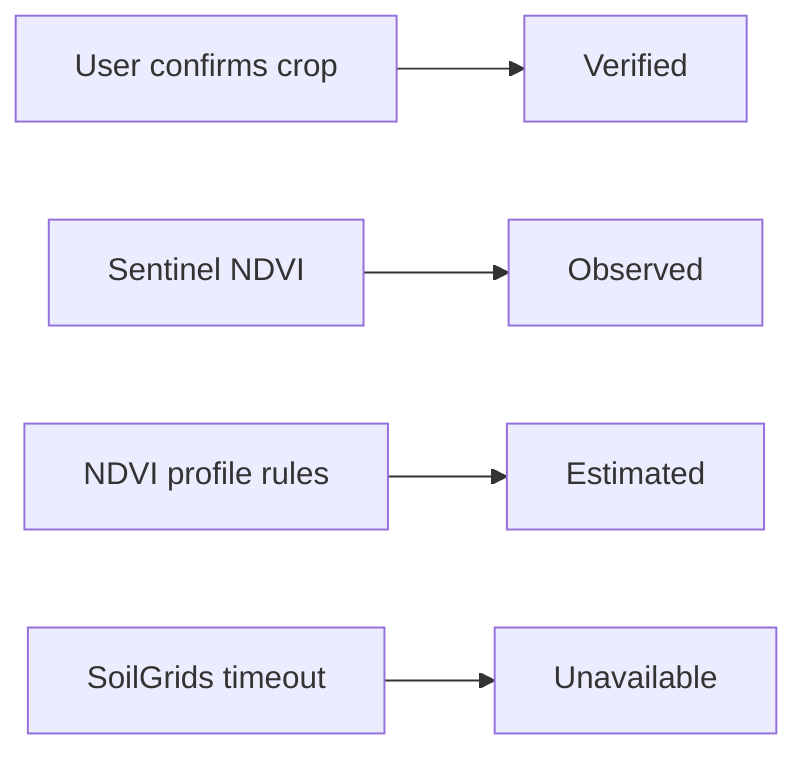
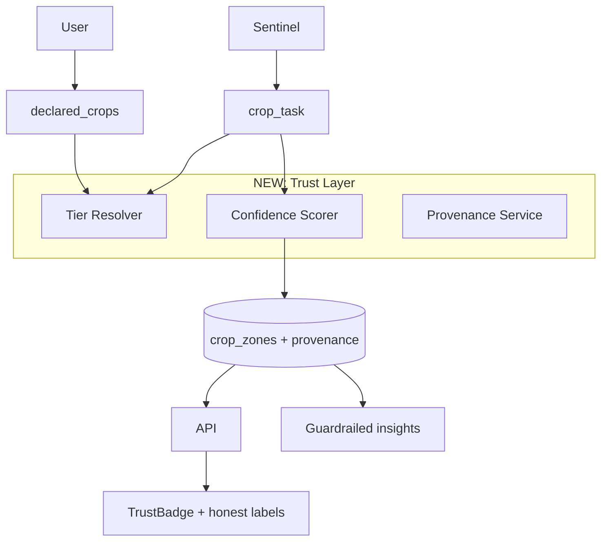

# Data Trust & Confidence Redesign — Executive Summary

| Field | Value |
|-------|-------|
| **Date** | 2026-07-08 |
| **Full plan** | [Data_Trust_Redesign_Plan.md](./Data_Trust_Redesign_Plan.md) |
| **Prerequisite** | Land Detail Consistency Fix (Phases 0–5) ✅ complete |
| **Timeline** | 7–11 weeks (1–2 engineers) |
| **PR count** | 22 ordered PRs |

---

## Problem in one sentence

The platform **scopes data correctly by land** but **overclaims crop intelligence** — rule-based NDVI matching is labeled "ML crop detection" with hardcoded 85–95% confidence, while trustworthy raw signals (Sentinel NDVI, Open-Meteo) lack explicit trust context.

---

## What we will not promise

- **Not** 100% crop ID from satellite alone
- **Not** instant ML accuracy (model trained on synthetic data only; `predict_crop` imported but never called in `crop_task.py`)

## What we will deliver

**Honest, measurable trust tiers** so farmers know what to trust and what to confirm.

---

## Trust tiers (user-facing)

| Tier | Label | Example on Giza Farm |
|------|-------|---------------------|
| **Verified** | Confirmed | User confirms "Vegetables / Citrus" |
| **Observed** | Observed | 136 real Sentinel-2 NDVI rows |
| **Estimated** | Estimated | "Winter Onion" from `crop_profiles.json` NDVI peak match (~40% confidence) |
| **Unavailable** | No data | SoilGrids profile (timeout) |

---

## Root causes (from codebase)

| Issue | Evidence | Fix |
|-------|----------|-----|
| Fake ML label | `crop_task.py` imports `predict_crop`, uses rules only | Rename to `ndvi_profile_match`; remove ML marketing |
| Hardcoded confidence | `avg_confidence=0.85`, `confidence=0.95` | `ConfidenceScorer` with measured formula |
| Misleading API | `detection_method: "spectral_signature"` | Honest method taxonomy |
| Multi-zone noise | Onion 79% + grapes 21%, ΔNDVI 0.013 | Separation gate: hide/merge if < 0.05 |
| UI says ML | `LAND_DETAIL_SOURCES.cropZones` | Update to "NDVI profile match" |
| AI states crops as fact | `land_analyst.py` context | Trust-aware prompts + linter |
| SoilGrids silent fail | 25s timeout, no retry | 3× retry + Unavailable tier + CTA |

---

## Target architecture (simplified)

**New tables:** `user_declared_crops`, `observation_provenance`, `land_data_quality_snapshots`

---

## How we reach "good confidence"

| Signal type | Good confidence means… | Mechanism |
|-------------|----------------------|-----------|
| NDVI values | Trust the number | Tier **Observed**; synthetic flagged |
| Crop name | Trust only after confirmation | Tier **Verified** via user; else **Estimated** with gated % bar |
| Multi-crop split | Trust only when spectrally separable | `separation_score > 0.05` to show; `> 0.15` to show % |
| Weather | Trust trend, note spatial limits | Polygon 5-point sampling (Phase 5) |
| Soil chemistry | Trust when fetched | SoilGrids retry ≥ 95% success |
| AI advice | Trust process, not crop label | Never assert unverified crops |

**Display rule:** Crop confidence bar shown only when `separation_score > 0.15` AND `confidence ≥ 0.35`.

---

## 10-phase rollout (effort)

| Phase | Focus | Days | Key deliverable |
|-------|-------|------|-----------------|
| **1** | Trust infrastructure | 6 | Provenance table, `TrustBadge`, `/trust-summary` |
| **2** | Crop honesty + user override | 5 | `user_declared_crops`, confirm UI, honest method names |
| **3** | Real confidence | 5 | Remove 0.85/0.95; Giza ~0.45 not 0.85 |
| **4** | Multi-zone validation | 4 | Suppress Giza grapes split |
| **5** | Spatial alignment | 6 | Polygon weather sampling |
| **6** | SoilGrids reliability | 3 | Retry + Unavailable UI |
| **7** | ML decision gate | 5–10 | Deprecate / blend / retrain (needs product input) |
| **8** | AI guardrails | 4 | Trust linter on insights |
| **9** | Ground truth collection | 5 | Field notes, export for training |
| **10** | Monitoring dashboard | 6 | Admin data-quality view |

**Total:** ~49–54 dev-days

---

## PR stack (22 PRs, first 10)

1. `feat/trust-module-scaffold`
2. `feat/observation-provenance-migration`
3. `feat/provenance-service-writes`
4. `feat/trust-summary-api`
5. `feat/trust-badge-ui`
6. `feat/ndvi-observed-tier-wiring`
7. `refactor/crop-identification-service`
8. `feat/user-declared-crops-model-api`
9. `feat/crop-detection-honest-method`
10. `feat/crop-confirm-ui`

…through PR-22 `feat/admin-data-quality-dashboard`. Full list in [plan § PR Plan](./Data_Trust_Redesign_Plan.md#pr-plan).

---

## Product decisions needed

| # | Question | Recommended default |
|---|----------|-------------------|
| 1 | Show unconfirmed crop as "Suggested" or hide? | **Suggested (Estimated)** |
| 2 | ML path: deprecate, blend, or retrain? | **Deprecate** until 100+ user confirmations |
| 3 | Ambiguous zones: merge or warn? | **Warn** if area > 15%; else merge |
| 4 | Prompt Giza Farm to confirm crop on first visit? | **Yes** |

See [Open Questions](./Data_Trust_Redesign_Plan.md#open-questions) for full list.

---

## Success metrics (90 days post-launch)

| Metric | Target |
|--------|--------|
| Lands with user-confirmed crop | ≥ 30% of active lands |
| Crop labels at Verified without user input | **0** |
| Hardcoded confidence in `crop_task.py` | **0** |
| SoilGrids fetch success rate | ≥ 95% |
| AI insights with crop-as-fact linter warnings | < 1% of generations |
| Giza Farm canary: tier snapshot stable | NDVI Observed, crop Estimated, soil Unavailable→retry |

---

## Giza Farm (`land_id=7`) — before vs after

| Field | Today | After redesign |
|-------|-------|----------------|
| NDVI | 136 real rows (trusted but unlabeled) | **Observed** + provenance |
| Crop | "Winter Onion" 85% + grapes 21% | **Estimated** ~45%; grapes suppressed (ΔNDVI 0.013) |
| User description | "Vegetables or Citrus" ignored | **Conflict banner** + confirm CTA |
| Soil profile | Failed silently | **Unavailable** + retry |
| AI insight | "Your winter onion…" | "Spectral pattern suggests onion; please confirm" |

---

## Key architectural decisions

1. **Four trust tiers** — verified / observed / estimated / unavailable
2. **User confirmation = only Verified crop path**
3. **`ndvi_profile_match`** replaces `spectral_signature` and "ML crop detection"
4. **Provenance as first-class table** — auditable, monitorable
5. **ML deferred** — Phase 7 gate after ground-truth collection
6. **Intelligence engine reads trust from DB** — no duplicate crop ID logic

---

## Next steps

1. **Product review** — resolve Open Questions (especially ML path and crop display)
2. **Start PR-01–PR-06** — trust infrastructure (no user-facing crop behavior change yet)
3. **Ship PR-09–PR-10** — honest labels + confirm flow (highest trust impact)
4. **Use Giza Farm as canary** throughout rollout

---

*For full design, schemas, API contracts, alternatives, security, observability, and verification checklist, see [Data_Trust_Redesign_Plan.md](./Data_Trust_Redesign_Plan.md).*