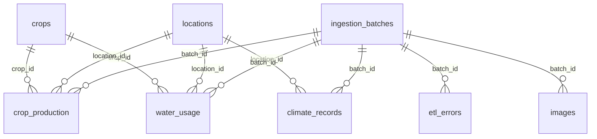

# Backend Database Design

## Purpose
Defines the backend data model required for implementation: tables, keys, relationships, and data ownership.

## Current Implemented State
From `Database/init.sql`:
- Databases: `agriculture`, `test_agriculture`
- Implemented table: `test_connection`

Current table:
- `test_connection(id, status, initialized_at)`

## Target Operational Schema (Essential)
The backend should implement these core tables first.

### Reference Tables

#### `crops`
- `crop_id` BIGINT PK
- `crop_name` VARCHAR(100) UNIQUE NOT NULL
- `created_at` TIMESTAMP

#### `locations`
- `location_id` BIGINT PK
- `governorate` VARCHAR(100) UNIQUE NOT NULL
- `region` VARCHAR(100) NULL
- `created_at` TIMESTAMP

### Control Tables

#### `ingestion_batches`
- `batch_id` BIGINT PK
- `source_system` VARCHAR(100) NOT NULL
- `source_version` VARCHAR(100) NULL
- `started_at` DATETIME NOT NULL
- `completed_at` DATETIME NULL
- `status` VARCHAR(50) NOT NULL

#### `etl_errors`
- `etl_error_id` BIGINT PK
- `batch_id` BIGINT FK -> `ingestion_batches.batch_id`
- `stage_name` VARCHAR(100) NOT NULL
- `record_key` VARCHAR(255) NULL
- `error_code` VARCHAR(100) NOT NULL
- `error_message` TEXT NOT NULL
- `is_retryable` BOOLEAN NOT NULL DEFAULT FALSE
- `created_at` TIMESTAMP

### Application Tables

#### `users`
- `user_id` BIGINT PK
- `email` VARCHAR(255) UNIQUE NOT NULL
- `password_hash` VARCHAR(255) NOT NULL
- `role` VARCHAR(50) NOT NULL
- `is_active` BOOLEAN NOT NULL DEFAULT TRUE
- `created_at` TIMESTAMP
- `updated_at` TIMESTAMP

#### `images`
- `image_id` BIGINT PK
- `source` VARCHAR(100) NOT NULL
- `path_raw` VARCHAR(500) NOT NULL
- `path_processed` VARCHAR(500) NULL
- `features_json` JSON NULL
- `captured_at` DATETIME NULL
- `processed_at` DATETIME NULL
- `batch_id` BIGINT FK -> `ingestion_batches.batch_id`
- `created_at` TIMESTAMP

### Clean Domain Tables

#### `crop_production`
- `production_id` BIGINT PK
- `crop_id` BIGINT FK -> `crops.crop_id`
- `location_id` BIGINT FK -> `locations.location_id`
- `year` INT NOT NULL
- `area_feddan` DECIMAL(14,4) NULL
- `area_hectare` DECIMAL(14,4) NULL
- `production_tonnes` DECIMAL(14,4) NOT NULL
- `batch_id` BIGINT FK -> `ingestion_batches.batch_id`
- `source_system` VARCHAR(100) NOT NULL
- `ingestion_timestamp` DATETIME NOT NULL
- `created_at` TIMESTAMP

Unique key:
- (`crop_id`, `location_id`, `year`, `batch_id`)

#### `water_usage`
- `water_usage_id` BIGINT PK
- `crop_id` BIGINT FK -> `crops.crop_id`
- `location_id` BIGINT FK -> `locations.location_id`
- `year` INT NOT NULL
- `water_need_m3_per_ha` DECIMAL(14,4) NULL
- `water_per_ton_m3` DECIMAL(14,4) NULL
- `irrigation_type` VARCHAR(50) NULL
- `batch_id` BIGINT FK -> `ingestion_batches.batch_id`
- `source_system` VARCHAR(100) NOT NULL
- `ingestion_timestamp` DATETIME NOT NULL
- `created_at` TIMESTAMP

Unique key:
- (`crop_id`, `location_id`, `year`, `batch_id`)

#### `climate_records`
- `climate_record_id` BIGINT PK
- `location_id` BIGINT FK -> `locations.location_id`
- `year` INT NOT NULL
- `temperature_mean` DECIMAL(10,4) NULL
- `humidity_pct` DECIMAL(10,4) NULL
- `batch_id` BIGINT FK -> `ingestion_batches.batch_id`
- `source_system` VARCHAR(100) NOT NULL
- `ingestion_timestamp` DATETIME NOT NULL
- `created_at` TIMESTAMP

Unique key:
- (`location_id`, `year`, `batch_id`)

## ERD (Essential)

## Join Contract
- `crop_production` <-> `water_usage`: (`crop_id`, `location_id`, `year`, `batch_id`)
- `crop_production` <-> `climate_records`: (`location_id`, `year`, `batch_id`)
- `water_usage` <-> `climate_records`: (`location_id`, `year`, `batch_id`)

## Backend Implementation Priority
1. Create SQLAlchemy models for: `users`, `crops`, `locations`, `crop_production`, `water_usage`, `climate_records`, `ingestion_batches`, `etl_errors`, `images`.
2. Add Alembic migrations.
3. Keep `test_connection` for infrastructure health checks only.

## Non-Goals for This Phase
- warehouse star schema implementation
- caching tables
- monitoring/logging tables
